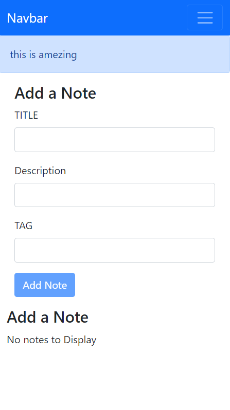
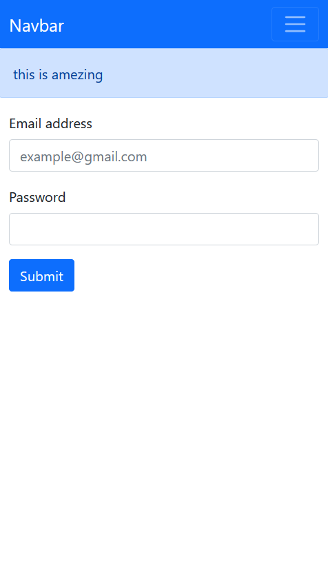
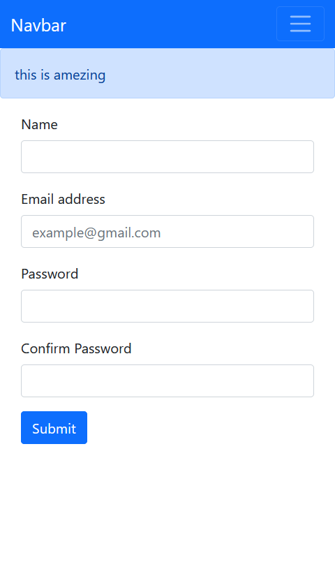

# Getting Started with Make Notes with React App

## MERN STACK

This project was bootstrapped with [MERN STACk]

MERN STACK

 --
|
|


## **Contents**
1. [Description](#description)
0. [Installation](#installation)
0. [Languages](#languages)
0. [Contribution](#contribution)


## **Description**

React is a free and open-source front-end JavaScript library for building user interfaces based on UI components.


#### Why React ?
React is a JavaScript library developed by Facebook which, among other things, was used to build Instagram.com. Its aim is to allow developers to easily create fast user interfaces for websites and applications alike. The main concept of React. js is virtual DOM.

## **Installation**
   ### Softeares Required :
   * [visual Studio Code](https://code.visualstudio.com/download)
   * [Node.js](https://nodejs.org/en/)

## **Libraries :**
 
 * [React](https://reactjs.org/docs/create-a-new-react-app.html)


_Just install nodeJS & VS Code, open the repository on VS code and start working._


## Projects picture 





<br>

## **Run Locally**

Clone the project

```bash
  git clone https://github.com/PSR0001/MERN-NOTEBOOK-CLIENT.git
```

Go to the project directory

```bash
  cd my-project
```

Install dependencies

```bash
  npm install
```

Start the server

```bash
  npm run start
```

## **Languages**

<!-- - 
<br>
<br>
<br> -->

- 
<br>

